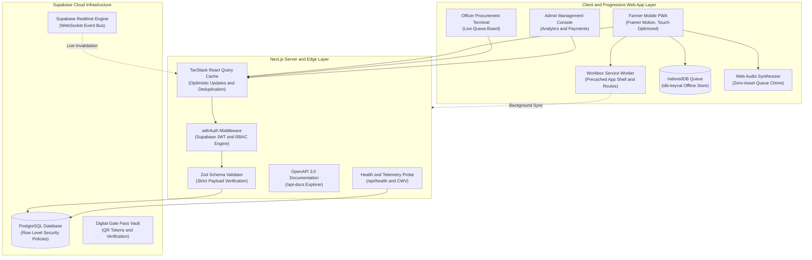
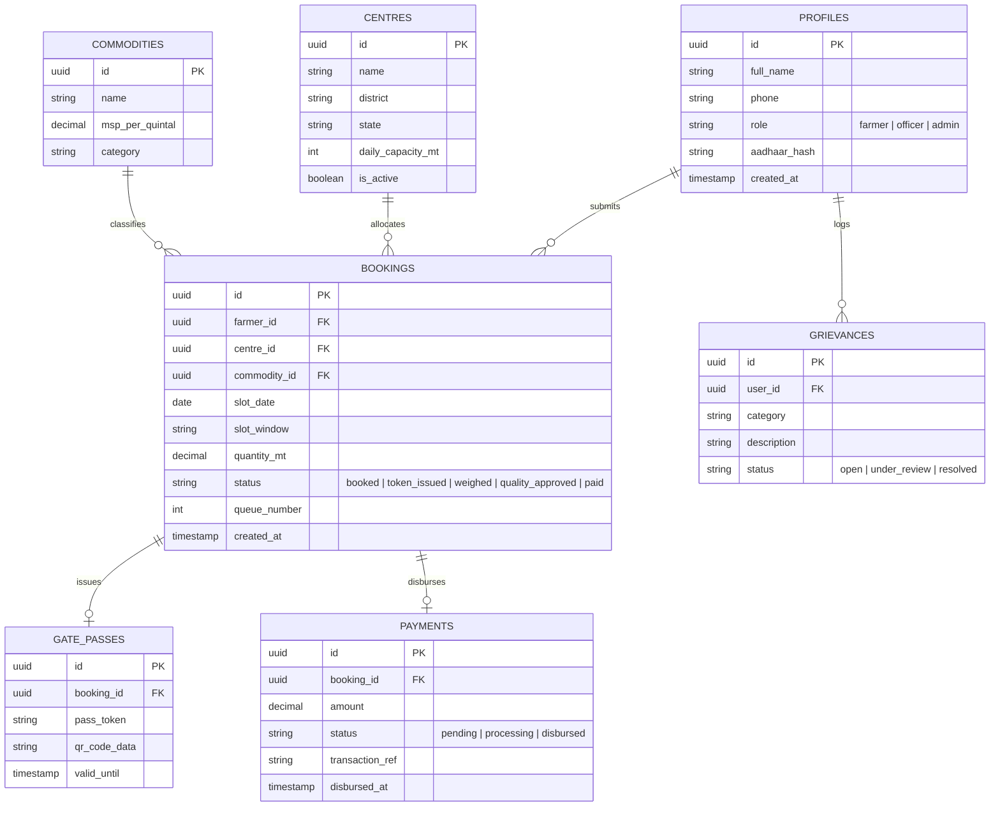

# 🌾 Kisan Procurement Portal

> **Production-Grade, Offline-First Real-Time Agri-Procurement Platform**  
> Engineered with Next.js, TypeScript, Supabase, TanStack React Query, Workbox PWA, and Docker.

[](.github/workflows/ci.yml)
[](tsconfig.json)
[](https://nextjs.org/)
[](https://tanstack.com/query/latest)
[](https://supabase.com/)
[](__tests__/)
[](Dockerfile)
[](pages/api-docs.tsx)

---

## 📌 Executive Summary

Agricultural procurement centres (Mandis) suffer from severe bottleneck congestion, unpredictable waiting times, and lack of transparency. **Kisan Procurement Portal** is a high-availability, offline-first digital token and slot allocation platform engineered for zero-connectivity rural environments and high-throughput mandi terminals.

The application allows farmers to schedule arrival windows, track dynamic queue positions with real-time audio/haptic alerts, and receive digital gate passes, while providing procurement officers and administrators with real-time weighbridge status progression, MSP disbursement analytics, and RBAC-governed audit trails.

---

## 🏗️ System Architecture



---

## 🗄️ Database Entity-Relationship Diagram (ERD)



---

## 🚀 Key Engineering Accomplishments

### 1. Offline-First Resilience (Zero-Connectivity Mandi Mode)
- **IndexedDB Asynchronous Store**: Replaced volatile local storage with an asynchronous `idb-keyval` queue capable of buffering slot reservations indefinitely when offline.
- **Background Sync API**: Automatic transaction replay via Service Worker synchronization (`sync-offline-bookings`) the instant network connectivity is restored.
- **Synthesized Audio Queue Alerts**: Built an in-browser **Web Audio API Synthesizer** (two-tone E5 to B5 frequencies) paired with hardware haptic patterns (`navigator.vibrate`), delivering audible alarms even without external audio asset downloads.

### 2. Modern Asynchronous State & Real-Time Synchronization
- **TanStack React Query**: Fully abstracted client data layer with dedicated hooks (`useBookings`, `useCentres`, `useCommodities`, `usePayments`).
- **Supabase Realtime WebSockets**: Automated cache invalidation whenever procurement officers advance token states, updating farmers' queue positions with sub-second latency.
- **Zero-Flicker Pagination**: Integrated `placeholderData: keepPreviousData` for paginated administrative tables.

### 3. Hardened Backend Architecture
- **Higher-Order Auth Middleware (`lib/apiAuth.ts`)**: Unified JWT token verification and Role-Based Access Control (RBAC) ensuring unprivileged farmers cannot touch officer endpoints.
- **Zod Schema Validation (`lib/validations.ts`)**: Strict runtime type assertions on all inbound booking and status mutation payloads.
- **HTTP Security Headers**: Enforced `X-Frame-Options: SAMEORIGIN`, `X-Content-Type-Options: nosniff`, and restrictive `Permissions-Policy` directly inside `next.config.js`.

### 4. Enterprise Observability & Documentation
- **Structured JSON Logger (`lib/logger.ts`)**: Standardized log formatting capturing execution context, timestamps, and serialized error stacks (ready for Datadog / CloudWatch / Sentry).
- **Interactive Swagger UI (`/api-docs`)**: OpenAPI 3.0 auto-documented contracts generated directly from endpoint JSDoc comments.
- **System Health Probe (`/api/health`)**: Real-time heartbeat checking process uptime, runtime environment, and active Supabase database latency.
- **Core Web Vitals Telemetry**: Continuous reporting of LCP, FID, CLS, and INP metrics directly in production.

### 5. Production Containerization & DevOps
- **Multi-Stage Dockerfile**: Uses Next.js `output: 'standalone'` to package a lean Alpine runtime container (~80% smaller footprint).
- **Hardened Container Security**: Enforces execution under a dedicated non-root user (`nextjs:nodejs`, UID 1001).
- **Docker Compose**: One-command orchestration (`docker compose up`) configured with health check intervals.
- **Automated CI/CD**: GitHub Actions workflow executing linting, TypeScript verification, Jest suites, and production builds on every push.

---

## 💻 Tech Stack

| Layer | Technology |
|---|---|
| **Framework** | Next.js 14 (Pages Router, Standalone Output) |
| **Language** | TypeScript 5 (Strict Mode) |
| **State Management** | TanStack React Query v5 |
| **Database & Auth** | Supabase (PostgreSQL 15, Row Level Security, Realtime WS, GoTrue Auth) |
| **Styling & Motion** | Tailwind CSS, Framer Motion |
| **PWA & Offline** | Workbox (`next-pwa`), IndexedDB (`idb-keyval`), Web Audio API |
| **API Validation** | Zod |
| **Documentation** | OpenAPI 3.0, Swagger UI (`next-swagger-doc`) |
| **Testing** | Jest, React Testing Library, ts-jest (32 passing tests) |
| **DevOps & Containers** | Docker (Multi-stage Alpine), Docker Compose, GitHub Actions |

---

## ⚡ Quickstart Guide

### Prerequisites
- Node.js 18+ or 20+
- Docker & Docker Compose (optional for containerized run)
- Free Supabase project (URL and keys)

### Option A: Run with Docker (Recommended)
```bash
# 1. Clone repository
git clone https://github.com/your-username/sih26032-farmer-procurement.git
cd sih26032-farmer-procurement

# 2. Configure environment
cp .env.local.example .env.local
# (Fill in your Supabase credentials in .env.local)

# 3. Build and spin up containers
docker compose up --build
```
The application will be live at `http://localhost:3000`.

---

### Option B: Local Development Setup

```bash
# 1. Clone and install dependencies
git clone https://github.com/your-username/sih26032-farmer-procurement.git
cd sih26032-farmer-procurement
npm install

# 2. Set up environment variables
cp .env.local.example .env.local
# (Populate NEXT_PUBLIC_SUPABASE_URL, NEXT_PUBLIC_SUPABASE_ANON_KEY, SUPABASE_SERVICE_ROLE_KEY)

# 3. Run database migrations
# In your Supabase SQL Editor, run:
# - supabase/schema.sql
# - supabase/seed.sql

# 4. Start development server
npm run dev
```

---

## 🧪 Testing & Verification

```bash
# Run unit & component test suite (32 tests across 10 suites)
npm run test

# Run TypeScript compiler checks (Strict mode)
npm run type-check

# Compile production standalone build
npm run build

# Run ESLint validation
npm run lint
```

---

## 📖 Interactive API Documentation & Health Check

Once the application is running, access the built-in observability tools:
- **Interactive Swagger UI**: [`http://localhost:3000/api-docs`](http://localhost:3000/api-docs)
- **Live System Health Probe**: [`http://localhost:3000/api/health`](http://localhost:3000/api/health)

---

## 📂 Project Structure

```
├── __tests__/              # Jest & RTL test suites (32 tests)
│   ├── api/                # API route integration tests
│   ├── components/         # React component tests
│   ├── hooks/              # Custom React Query hook tests
│   └── lib/                # Utility & validation tests
├── components/             # Reusable UI components (Framer Motion, a11y)
├── hooks/                  # TanStack React Query custom hooks
├── lib/                    # Core business logic, auth middleware, logger
│   ├── apiAuth.ts          # withAuth RBAC middleware
│   ├── audioAlert.ts       # Web Audio API chime synthesizer
│   ├── env.ts              # Zod environment validator
│   ├── logger.ts           # Structured JSON logger
│   ├── offlineQueue.ts     # IndexedDB offline synchronization
│   └── validations.ts      # Zod validation schemas
├── pages/                  # Next.js routes & API endpoints
│   ├── admin/              # Administrative analytics & MSP payments
│   ├── api/                # Backend REST endpoints (OpenAPI annotated)
│   ├── farmer/             # Farmer booking wizard & real-time dashboard
│   ├── officer/            # Mandi procurement line management
│   ├── api-docs.tsx        # Swagger UI explorer page
│   └── _app.js             # Global providers & Core Web Vitals telemetry
├── public/                 # Static assets, icons, PWA manifests
├── supabase/               # PostgreSQL schema migrations & seed files
├── Dockerfile              # Multi-stage production container build
├── docker-compose.yml      # Local container orchestration
└── next.config.js          # Standalone output, Workbox PWA & security headers
```

---

## 📄 License
Licensed under the [MIT License](LICENSE).
